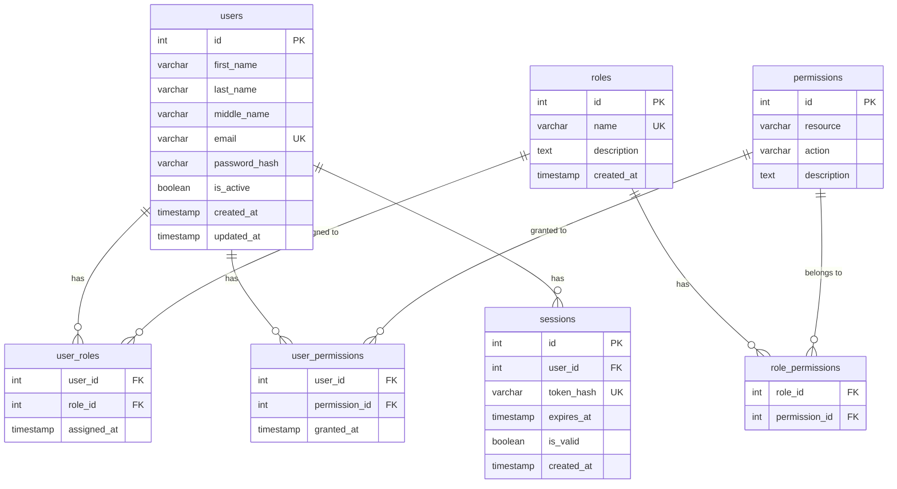
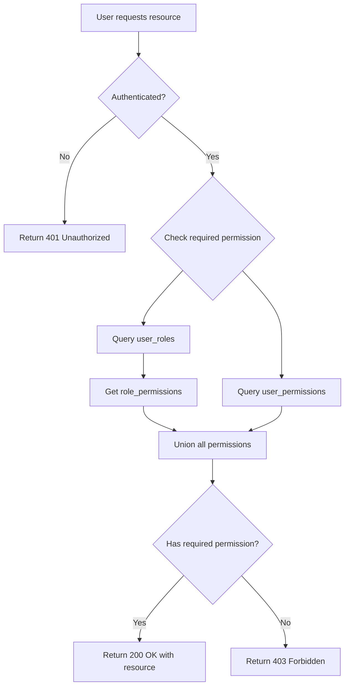

# Database Schema Documentation

## Overview

This document provides a detailed explanation of the database schema for the Auth System, including table structures, relationships, and the Role-Based Access Control (RBAC) implementation.

## Entity Relationship Diagram



## Table Descriptions

### Core Entity Tables

#### users
Stores user account information and authentication credentials.

| Column | Type | Constraints | Description |
|--------|------|-------------|-------------|
| id | SERIAL | PRIMARY KEY | Unique user identifier |
| first_name | VARCHAR(100) | NOT NULL | User's first name |
| last_name | VARCHAR(100) | NOT NULL | User's last name |
| middle_name | VARCHAR(100) | NULL | User's middle name (optional) |
| email | VARCHAR(255) | UNIQUE, NOT NULL | User's email address (login identifier) |
| password_hash | VARCHAR(255) | NOT NULL | Bcrypt hashed password |
| is_active | BOOLEAN | DEFAULT TRUE | Soft delete flag |
| created_at | TIMESTAMP | DEFAULT NOW() | Account creation timestamp |
| updated_at | TIMESTAMP | DEFAULT NOW() | Last update timestamp |

**Indexes:**
- `idx_users_email`: Fast email lookups during login
- `idx_users_active`: Filter active/inactive users

**Business Rules:**
- Email must be unique across all users
- Password is never stored in plaintext
- Soft delete sets `is_active = FALSE` without removing data
- `updated_at` is automatically updated on any modification

#### roles
Defines named collections of permissions that can be assigned to users.

| Column | Type | Constraints | Description |
|--------|------|-------------|-------------|
| id | SERIAL | PRIMARY KEY | Unique role identifier |
| name | VARCHAR(100) | UNIQUE, NOT NULL | Role name (e.g., "admin", "user") |
| description | TEXT | NULL | Human-readable role description |
| created_at | TIMESTAMP | DEFAULT NOW() | Role creation timestamp |

**Business Rules:**
- Role names must be unique
- Roles can have zero or more permissions
- Roles can be assigned to zero or more users
- Deleting a role removes all user-role associations

**Default Roles:**
- `admin`: Full system access with all permissions
- `user`: Basic read-only access to resources

#### permissions
Defines specific actions that can be performed on resources.

| Column | Type | Constraints | Description |
|--------|------|-------------|-------------|
| id | SERIAL | PRIMARY KEY | Unique permission identifier |
| resource | VARCHAR(100) | NOT NULL | Resource type (e.g., "documents", "projects") |
| action | VARCHAR(50) | NOT NULL | Action type (e.g., "read", "create", "update", "delete") |
| description | TEXT | NULL | Human-readable permission description |

**Constraints:**
- UNIQUE(resource, action): Each resource-action pair is unique

**Business Rules:**
- Permissions follow the format: `resource:action`
- Standard CRUD actions: create, read, update, delete
- Permissions can be assigned to roles or directly to users
- Deleting a permission removes all associations

**Default Permissions:**
- `documents:read`, `documents:create`, `documents:update`, `documents:delete`
- `projects:read`, `projects:create`, `projects:update`, `projects:delete`
- `reports:read`, `reports:create`, `reports:update`, `reports:delete`

#### sessions
Tracks active authentication sessions for token management.

| Column | Type | Constraints | Description |
|--------|------|-------------|-------------|
| id | SERIAL | PRIMARY KEY | Unique session identifier |
| user_id | INTEGER | FK → users(id) | User who owns this session |
| token_hash | VARCHAR(255) | UNIQUE, NOT NULL | Hashed JWT token |
| expires_at | TIMESTAMP | NOT NULL | Token expiration time |
| is_valid | BOOLEAN | DEFAULT TRUE | Session validity flag |
| created_at | TIMESTAMP | DEFAULT NOW() | Session creation timestamp |

**Indexes:**
- `idx_sessions_token`: Fast token validation lookups
- `idx_sessions_user`: Query all sessions for a user
- `idx_sessions_expiry`: Cleanup expired sessions

**Business Rules:**
- Each session is tied to a specific user
- Tokens are stored as hashes for security
- Logout sets `is_valid = FALSE`
- Expired sessions can be cleaned up periodically
- User deletion cascades to remove all sessions

### Association Tables (Many-to-Many)

#### user_roles
Links users to their assigned roles.

| Column | Type | Constraints | Description |
|--------|------|-------------|-------------|
| user_id | INTEGER | FK → users(id), PK | User identifier |
| role_id | INTEGER | FK → roles(id), PK | Role identifier |
| assigned_at | TIMESTAMP | DEFAULT NOW() | Assignment timestamp |

**Constraints:**
- PRIMARY KEY (user_id, role_id): Prevents duplicate assignments
- ON DELETE CASCADE: Removing user or role removes association

**Business Rules:**
- A user can have multiple roles
- A role can be assigned to multiple users
- Assigning a role grants all its permissions to the user
- Revoking a role removes its permissions (unless granted elsewhere)

#### role_permissions
Links roles to their associated permissions.

| Column | Type | Constraints | Description |
|--------|------|-------------|-------------|
| role_id | INTEGER | FK → roles(id), PK | Role identifier |
| permission_id | INTEGER | FK → permissions(id), PK | Permission identifier |

**Constraints:**
- PRIMARY KEY (role_id, permission_id): Prevents duplicate assignments
- ON DELETE CASCADE: Removing role or permission removes association

**Business Rules:**
- A role can have multiple permissions
- A permission can belong to multiple roles
- Updating role permissions affects all users with that role
- Changes propagate immediately to authorization checks

#### user_permissions
Links users to directly granted permissions (bypassing roles).

| Column | Type | Constraints | Description |
|--------|------|-------------|-------------|
| user_id | INTEGER | FK → users(id), PK | User identifier |
| permission_id | INTEGER | FK → permissions(id), PK | Permission identifier |
| granted_at | TIMESTAMP | DEFAULT NOW() | Grant timestamp |

**Constraints:**
- PRIMARY KEY (user_id, permission_id): Prevents duplicate grants
- ON DELETE CASCADE: Removing user or permission removes association

**Business Rules:**
- Direct permissions supplement role-based permissions
- A user can have permissions from both roles and direct grants
- Direct permissions persist even if roles change
- Used for exceptional access grants

## RBAC Model Implementation

### Permission Evaluation Flow



### Permission Sources

The RBAC model supports two sources of permissions:

1. **Role-Based Permissions** (Indirect)
   - User → user_roles → roles → role_permissions → permissions
   - User inherits ALL permissions from ALL assigned roles
   - Changes to role permissions affect all users with that role

2. **Direct Permissions** (Explicit)
   - User → user_permissions → permissions
   - Specific permissions granted directly to a user
   - Independent of role assignments
   - Used for exceptional access grants

### Permission Union Logic

When checking if a user has a permission:

```sql
-- Pseudo-SQL for permission check
SELECT EXISTS (
    -- Check role-based permissions
    SELECT 1 FROM user_roles ur
    JOIN role_permissions rp ON ur.role_id = rp.role_id
    JOIN permissions p ON rp.permission_id = p.id
    WHERE ur.user_id = ? 
      AND p.resource = ? 
      AND p.action = ?
    
    UNION
    
    -- Check direct permissions
    SELECT 1 FROM user_permissions up
    JOIN permissions p ON up.permission_id = p.id
    WHERE up.user_id = ? 
      AND p.resource = ? 
      AND p.action = ?
)
```

**Key Principle**: A user has access if they have the permission through **ANY** source (role OR direct grant).

### Example Scenarios

#### Scenario 1: Basic Role Assignment

```
User: Alice
Roles: ["user"]
Role "user" permissions: ["documents:read", "projects:read"]
Direct permissions: []

Result: Alice can read documents and projects
```

#### Scenario 2: Multiple Roles

```
User: Bob
Roles: ["user", "editor"]
Role "user" permissions: ["documents:read", "projects:read"]
Role "editor" permissions: ["documents:create", "documents:update"]
Direct permissions: []

Result: Bob can read documents/projects AND create/update documents
```

#### Scenario 3: Direct Permission Grant

```
User: Charlie
Roles: ["user"]
Role "user" permissions: ["documents:read"]
Direct permissions: ["reports:create"]

Result: Charlie can read documents (via role) AND create reports (direct)
```

#### Scenario 4: Permission Overlap

```
User: Diana
Roles: ["user"]
Role "user" permissions: ["documents:read"]
Direct permissions: ["documents:read"]

Result: Diana can read documents (redundant but valid - has permission via both sources)
```

### Role Hierarchy Considerations

**Current Implementation**: Flat role structure
- No role inheritance
- No role hierarchy
- All roles are equal in structure

**Future Enhancement**: Role hierarchy could be added:
- Parent roles inherit child role permissions
- Example: "super_admin" → "admin" → "moderator" → "user"
- Requires additional `parent_role_id` column in roles table

### Admin Role Special Handling

The "admin" role has special characteristics:

1. **Cannot be deleted**: Enforced in application code
2. **Has all permissions**: Seeded with full CRUD on all resources
3. **Grants admin API access**: Required for role/permission management
4. **At least one admin required**: System should maintain at least one admin user

### Permission Naming Convention

Permissions follow the format: `resource:action`

**Resources**: Logical groupings of related data
- Examples: documents, projects, reports, users, roles, permissions

**Actions**: Standard CRUD operations
- `read`: View/list resources
- `create`: Create new resources
- `update`: Modify existing resources
- `delete`: Remove resources

**Examples**:
- `documents:read`: Can view documents
- `projects:create`: Can create new projects
- `users:update`: Can modify user accounts
- `roles:delete`: Can delete roles

### Soft Delete and Permissions

When a user is soft-deleted (`is_active = FALSE`):

1. User record remains in database
2. All role assignments remain intact
3. All direct permissions remain intact
4. User cannot authenticate (login rejected)
5. Existing sessions are invalidated
6. User can be reactivated by setting `is_active = TRUE`

This preserves audit trails and allows account recovery.

## Database Indexes

### Performance Optimization

| Index Name | Table | Columns | Purpose |
|------------|-------|---------|---------|
| `idx_users_email` | users | email | Fast login lookups |
| `idx_users_active` | users | is_active | Filter active users |
| `idx_sessions_token` | sessions | token_hash | Fast token validation |
| `idx_sessions_user` | sessions | user_id | User session queries |
| `idx_sessions_expiry` | sessions | expires_at | Expired session cleanup |

### Query Patterns

**Authentication** (uses `idx_users_email`):
```sql
SELECT * FROM users WHERE email = 'user@example.com' AND is_active = TRUE;
```

**Token Validation** (uses `idx_sessions_token`):
```sql
SELECT * FROM sessions WHERE token_hash = ? AND is_valid = TRUE AND expires_at > NOW();
```

**Permission Check** (uses foreign key indexes):
```sql
-- Check via roles
SELECT p.* FROM permissions p
JOIN role_permissions rp ON p.id = rp.permission_id
JOIN user_roles ur ON rp.role_id = ur.role_id
WHERE ur.user_id = ? AND p.resource = ? AND p.action = ?;

-- Check direct permissions
SELECT p.* FROM permissions p
JOIN user_permissions up ON p.id = up.permission_id
WHERE up.user_id = ? AND p.resource = ? AND p.action = ?;
```

## Migration Strategy

### Initial Schema Creation

The initial migration (`eff9295ece13_initial_schema.py`) creates:
1. All core tables (users, roles, permissions, sessions)
2. All association tables (user_roles, role_permissions, user_permissions)
3. All indexes for performance
4. All foreign key constraints with CASCADE rules

### Seeding Data

The `seed.py` script populates:
1. Default roles (admin, user)
2. Standard permissions (CRUD for documents, projects, reports)
3. Role-permission associations
4. Initial admin user

### Future Migrations

When adding new features:
1. Create new migration: `alembic revision -m "description"`
2. Add new tables/columns as needed
3. Update seed script if new default data required
4. Test migration on development database
5. Apply to production: `alembic upgrade head`

## Data Integrity Rules

### Referential Integrity

All foreign keys use `ON DELETE CASCADE`:
- Deleting a user removes their roles, permissions, and sessions
- Deleting a role removes user-role and role-permission associations
- Deleting a permission removes role-permission and user-permission associations

### Unique Constraints

- `users.email`: Prevents duplicate accounts
- `roles.name`: Prevents duplicate role names
- `(permissions.resource, permissions.action)`: Prevents duplicate permissions
- `sessions.token_hash`: Prevents token reuse
- Association table PKs: Prevents duplicate assignments

### Check Constraints

Currently none, but could add:
- Email format validation
- Password hash format validation
- Action must be in ['create', 'read', 'update', 'delete']

## Security Considerations

### Password Storage

- Passwords are hashed using bcrypt before storage
- `password_hash` column stores the hash, never plaintext
- Cost factor configurable via `BCRYPT_ROUNDS` environment variable
- Minimum recommended: 12 rounds

### Token Storage

- JWT tokens are hashed before storage in sessions table
- `token_hash` column stores SHA-256 hash of token
- Prevents token theft from database compromise
- Tokens can be invalidated by setting `is_valid = FALSE`

### Audit Trail

The schema supports audit trails through:
- `created_at` timestamps on all core tables
- `assigned_at` / `granted_at` timestamps on associations
- Soft delete preserves user data for auditing
- Session history tracks authentication events

### SQL Injection Prevention

- All queries use SQLAlchemy ORM with parameterized queries
- No raw SQL with string concatenation
- Input validation via Pydantic models before database access

## Backup and Recovery

### Recommended Backup Strategy

1. **Full Backups**: Daily full database dumps
2. **Incremental Backups**: Hourly transaction logs
3. **Retention**: 30 days of daily backups, 7 days of hourly
4. **Testing**: Monthly restore tests to verify backup integrity

### Critical Tables Priority

1. **users**: User accounts and credentials
2. **sessions**: Active authentication state
3. **user_roles, user_permissions**: Access control assignments
4. **roles, permissions**: Access control definitions

### Recovery Scenarios

**Lost user account**: Restore from backup
**Corrupted permissions**: Re-run seed script
**Session issues**: Clear sessions table, users re-login
**Complete failure**: Restore full database from backup

## Performance Considerations

### Expected Query Patterns

- **High Frequency**: Authentication (login), token validation, permission checks
- **Medium Frequency**: User profile reads, role assignments
- **Low Frequency**: Role/permission management, user registration

### Optimization Strategies

1. **Indexes**: Cover all foreign keys and frequently queried columns
2. **Connection Pooling**: Reuse database connections (SQLAlchemy default)
3. **Query Optimization**: Use joins instead of N+1 queries
4. **Caching**: Consider caching permission checks (not implemented)
5. **Session Cleanup**: Periodic job to remove expired sessions

### Scalability Notes

- Current design supports thousands of users
- For larger scale, consider:
  - Read replicas for permission checks
  - Redis cache for permission results
  - Partitioning sessions table by date
  - Archiving inactive users to separate table

## Conclusion

This database schema implements a flexible RBAC system that:
- Supports both role-based and direct permissions
- Maintains referential integrity through foreign keys
- Provides audit trails through timestamps
- Enables soft delete for data retention
- Optimizes common queries through indexes
- Follows security best practices for credential storage

The design balances flexibility, security, and performance for a production authentication and authorization system.
